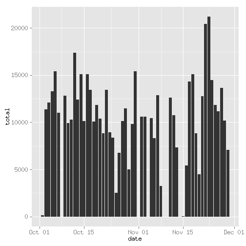
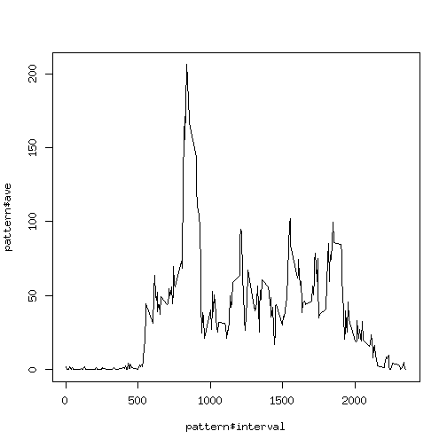
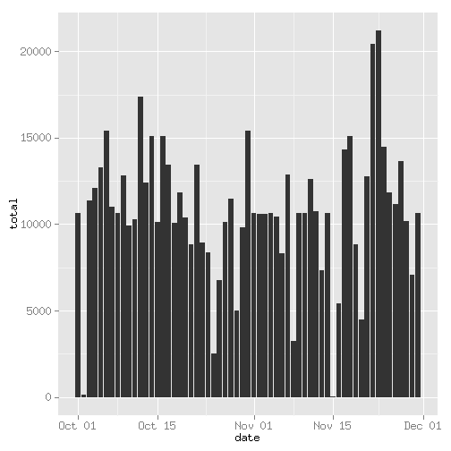
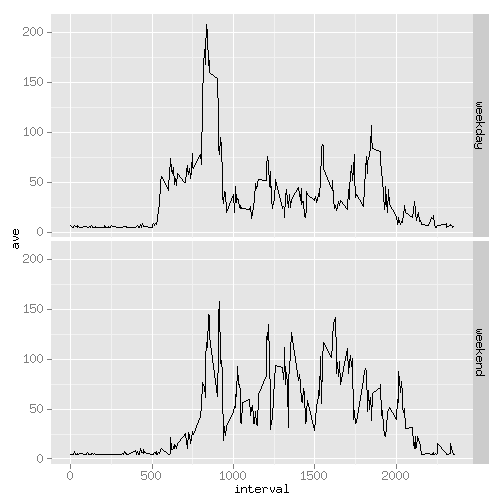

## Loading and preprocessing the data
Download file activity.zip from https://d396qusza40orc.cloudfront.net/repdata%2Fdata%2Factivity.zip, store it in the working directory, unzip and load file activity.csv
with function "read.csv()" into R.
Apply function "str()" to get a first informal view of the data.


```r
activity = read.csv("./activity.csv")
str(activity)
```

```
## 'data.frame':	17568 obs. of  3 variables:
##  $ steps   : int  NA NA NA NA NA NA NA NA NA NA ...
##  $ date    : Factor w/ 61 levels "2012-10-01","2012-10-02",..: 1 1 1 1 1 1 1 1 1 1 ...
##  $ interval: int  0 5 10 15 20 25 30 35 40 45 ...
```
The "date" variable is casted to a variable  of class "Date" with the "as.POSIXct"
function.

```r
activity$date = as.POSIXct(activity$date, format = "%Y-%m-%d")
```

## What is mean total number of steps taken per day?
To address this question we load library "plyr" and use function
"ddply()" to get a new data frame "stepsPerDay" containing the "date" and "total"
(of steps per day) variables.
For the moment we ignore NAs. We inspect a summary of stepsPerDay.

```r
library(plyr)
stepsPerDay = ddply(activity, "date", summarise, total = sum(steps))
summary(stepsPerDay)
```

```
##       date                         total      
##  Min.   :2012-10-01 00:00:00   Min.   :   41  
##  1st Qu.:2012-10-16 00:00:00   1st Qu.: 8841  
##  Median :2012-10-31 00:00:00   Median :10765  
##  Mean   :2012-10-30 23:32:27   Mean   :10766  
##  3rd Qu.:2012-11-15 00:00:00   3rd Qu.:13294  
##  Max.   :2012-11-30 00:00:00   Max.   :21194  
##                                NA's   :8
```

### Histogram
We load library "ggplot2" and use function "qplot()" to create the required histogram. 


```r
library(ggplot2)
qplot(date, total, data = stepsPerDay, geom = "histogram", stat = "identity")
```

```
## Warning: Removed 8 rows containing missing values (position_stack).
```

 

### Mean and Median
Apply functions "mean()" and "median()" to the "total" variable of stepsPerDay, take care of NAs.


```r
mean(stepsPerDay$total, na.rm = TRUE)
```

```
## [1] 10766.19
```

```r
median(stepsPerDay$total, na.rm = TRUE)
```

```
## [1] 10765
```

## What is the average daily activity pattern?
We use function "pply()" to get a new data frame "pattern" containing the variable "interval" 
and a variable "ave" which describes the average of numbers of steps across all days.
### Plot the time series.

```r
pattern = ddply(activity, c("interval"), summarise, ave = mean(steps, na.rm = TRUE))
plot(pattern$ave ~ pattern$interval, type = "l")
```

 

#### Find interval with maximal number of steps on average across all days
We use function "which()" to identify the maximum number of steps and get the interval
where the maximum is reached. We find interval 835.


```r
pattern[which(pattern$ave == max(pattern$ave)), ]$interval
```

```
## [1] 835
```

## Imputing missing values
A summary of activity shows that there are 2304 missing values, all in column "steps" and that the mean of steps per interval is 37.38.


```r
summary(activity)
```

```
##      steps             date                        interval     
##  Min.   :  0.00   Min.   :2012-10-01 00:00:00   Min.   :   0.0  
##  1st Qu.:  0.00   1st Qu.:2012-10-16 00:00:00   1st Qu.: 588.8  
##  Median :  0.00   Median :2012-10-31 00:00:00   Median :1177.5  
##  Mean   : 37.38   Mean   :2012-10-30 23:32:27   Mean   :1177.5  
##  3rd Qu.: 12.00   3rd Qu.:2012-11-15 00:00:00   3rd Qu.:1766.2  
##  Max.   :806.00   Max.   :2012-11-30 00:00:00   Max.   :2355.0  
##  NA's   :2304
```
We make a copy activityMod of activity and set all missing values in the steps column to
37. 


```r
activityMod = activity
activityMod$steps[is.na(activityMod$steps)] = 37
```
Apply function
"ddply()" to get a new data frame "stepsPerDayMod" containing the "date" and "total"
(of steps per day) variables. Plot the required histogram, compute mean and median.
The procedure is quite analogous to what has been done for data frame activity.


```r
stepsPerDayMod = ddply(activityMod, "date", summarise, total = sum(steps))
qplot(date, total, data = stepsPerDayMod, geom = "histogram", stat = "identity")
```

 

```r
mean(stepsPerDayMod$total, na.rm = TRUE)
```

```
## [1] 10751.74
```

```r
median(stepsPerDayMod$total, na.rm = TRUE)
```

```
## [1] 10656
```

The estimates of total daily number of steps did slightly change. For example: in activity, on 2012-10-01 all steps values were missing, whereas in activityMod these steps values now
are all equal to 37. The total number of steps for this day was missing in activity, whereas now it is equal to 288*37 = 10656. This is slightly inferior to the mean total in activity which is equal to 10766. 

A similar effect happens for all days where missing values were present and replaced by 37.
This explains why estimates for total number of steps are slightly inferior in the data set
when missing values are replaced by 37.

## Are there differences in activity patterns between weekdays and weekends?
Create a new factor variable in activityMod with two levels "weekday" and "weekend" indicating weather a given date is weekday or weekend.


```r
activityMod$weekday = weekdays(activityMod$date)
activityMod$weekday[activityMod$weekday %in% c("Saturday", "Sunday")] = "weekend"
activityMod$weekday[activityMod$weekday != "weekend"] = "weekday"
activityMod$weekday = factor(activityMod$weekday)
```
We use function "pply()" to get a new data frame "pattern" containing the "interval" and "weekday" variables
and a variable "ave" which describes the average of numbers of steps across all days.

Plot the required activity patterns using function "qplot()" with parameters
geom = "line" and "facets = weekday ~ .".


```r
pattern = ddply(activityMod, c("interval", "weekday"), summarise, ave = mean(steps))
qplot(interval, ave, data = pattern, geom = "line", facets = weekday ~ .)
```

 

During weekends activity seems to begin later and last a little bit longer than during  weekdays. A peak of activity can be observed near interval 800 (approximatively), but during  weekdays it is much higher than during weekends. On the other hand, for intervals 1000 through 2000, activity seems higher during weekends. 


